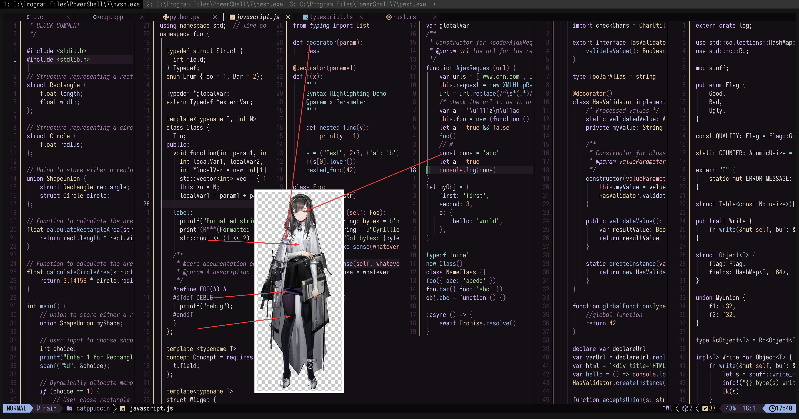

# priestess_(arknights)

- **Character:** 普瑞赛斯
- **Source:** 明日方舟 / Arknights
- **Alias:** `Priestess` (EN), `プリースティス` (JP)
- **Reference:** [Safebooru Wiki](<https://safebooru.donmai.us/wiki_pages/priestess_(arknights)>), [Moegirlpedia](https://zh.moegirl.org.cn/zh-hans/%E6%99%AE%E7%91%9E%E8%B5%9B%E6%96%AF)
- **Index:** `#5`

---

> `priestess_(arknights)` is the 5th character in this project.
>
> The first version looked very similar to [Helix](https://helix-editor.com/), so I lowered the brightness. Unfortunately, it still just looked like a darker version of Helix.
>
> I created this theme to test a purple-based palette. In terms of creating a unique look, I'd consider this attempt a relative failure.

## Palette Files

| File                                                            | Purpose                                         |
| --------------------------------------------------------------- | ----------------------------------------------- |
| [`palette.json`](./palette.json)                                | Full color data                                 |
| [`palette-whiskers.json`](./palette-whiskers.json)             | Catppuccin “color_overrides” ready for Whiskers |

### Contrast Matrix

| File                                                         | Description                  |
| ------------------------------------------------------------ | ---------------------------- |
| [`contrast-matrix.json`](./contrast/contrast-matrix.json) | All-vs-all contrast ratios   |
| [`contrast-base.json`](./contrast/contrast-base.json)     | Each swatch against **Base** |
| [`contrast-report.md`](./contrast/contrast-report.md)     | Human-readable summary       |

## Reference Artwork
 
A picture (or two) used for color sampling.
 


## Porting How-Tos
 
<details>
<summary>Neovim example (Catppuccin macchiato)</summary>

```lua
require("catppuccin").setup {
    color_overrides = {
        macchiato = {
        rosewater= "#EFDDDA",
        flamingo = "#E9CCCC",
        pink     = "#AF9FCE",
        mauve    = "#D5B3F8",
        red      = "#DD96A0",
        maroon   = "#E1A5AA",
        peach    = "#E3AE90",
        yellow   = "#E2CFAA",
        green    = "#ABCF9F",
        teal     = "#96C9C2",
        sky      = "#9DCED6",
        sapphire = "#8CBED4",
        blue     = "#99B2E4",
        lavender = "#C0C4EE",
        text     = "#DAD7D9",
        subtext0 = "#B2ACB0",
        subtext1 = "#C6C1C4",
        base     = "#140F15",
        mantle   = "#0B080C",
        crust    = "#030203",
        surface0 = "#2A1F2D",
        surface1 = "#413045",
        surface2 = "#553F5A",
        overlay0 = "#6C5072",
        overlay1 = "#82608A",
        overlay2 = "#97749E",
        },
    }
}
```

</details>
