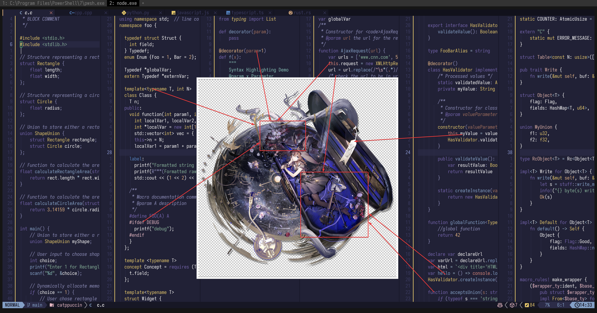

# amiya_(medic)_(solo_around_the_world)_(arknights)

- **Character:** 阿米娅 (医疗)(寰宇独奏)
- **Source:** 明日方舟 / Arknights
- **Alias:** `Amiya (Medic) (Solo Around the World) (Arknights)` (EN), `アーミヤ(医療)(宙に響く独奏)` (JP)
- **Reference:** [Safebooru Wiki](<https://safebooru.donmai.us/wiki_pages/amiya_(medic)_(solo_around_the_world)_(arknights)>), [PRTS](https://prts.wiki/w/%E9%98%BF%E7%B1%B3%E5%A8%85(%E5%8C%BB%E7%96%97))
- **Index:** `#12`

---

> `amiya_(medic)_(solo_around_the_world)_(arknights)` is the 12th character in this project.
>
> Given her popularity, I don't even know if this attempt does her justice, or how many more versions are yet to come.

## Palette Files

| File                                               | Purpose                                         |
| -------------------------------------------------- | ----------------------------------------------- |
| [`palette.json`](./palette.json)                   | Full color data                                 |
| [`palette-whiskers.json`](./palette-whiskers.json) | Catppuccin “color_overrides” ready for Whiskers |

### Contrast Matrix

| File                                                         | Description                  |
| ------------------------------------------------------------ | ---------------------------- |
| [`contrast-matrix.json`](./contrast/contrast-matrix.json) | All-vs-all contrast ratios   |
| [`contrast-base.json`](./contrast/contrast-base.json)     | Each swatch against **Base** |
| [`contrast-report.md`](./contrast/contrast-report.md)     | Human-readable summary       |

<!-- 
TODO: Add reference artwork section when screenshot environment is available

## Reference Artwork

A picture (or two) used for color sampling.

 
-->

## Porting How-Tos

<details>
<summary>Neovim example (Catppuccin mocha)</summary>

```lua
require("catppuccin").setup {
    color_overrides = {
        mocha = {
        rosewater= "#f2d5cf",
        flamingo = "#dcafa6",
        pink     = "#e5b8c3",
        mauve    = "#7363aa",
        red      = "#d78579",
        maroon   = "#a06e5c",
        peach    = "#e5b484",
        yellow   = "#e5c76b",
        green    = "#88b39a",
        teal     = "#88c1b7",
        sky      = "#a6c2d6",
        sapphire = "#5583c1",
        blue     = "#84a0c6",
        lavender = "#8d9ad5",
        text     = "#fbfaf9",
        subtext0 = "#daccbf",
        subtext1 = "#e9e3dc",
        base     = "#212136",
        mantle   = "#171725",
        crust    = "#11111c",
        surface0 = "#2c2c48",
        surface1 = "#3b3b62",
        surface2 = "#4b4b7b",
        overlay0 = "#5a5a94",
        overlay1 = "#7070a7",
        overlay2 = "#8d8db9",
        },
    }
}
```

</details>