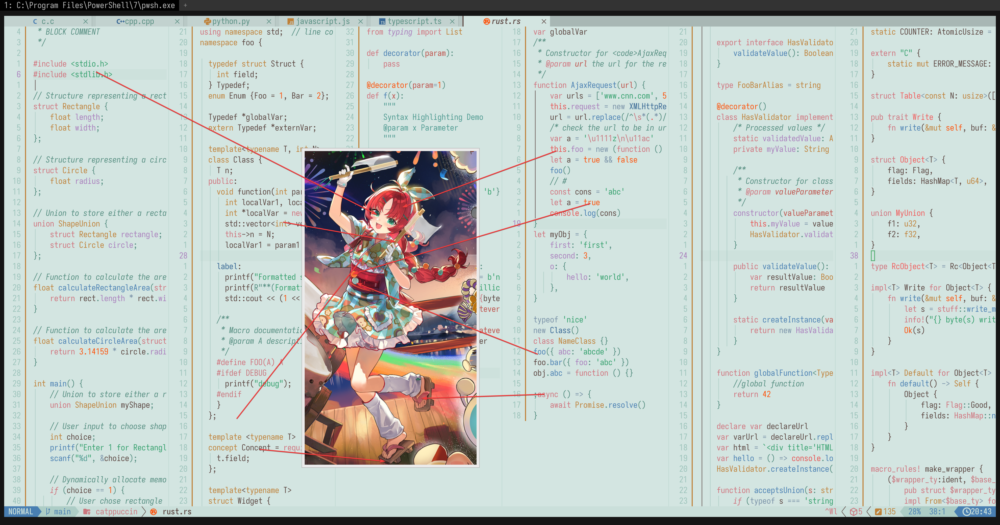

# myrtle_(bustling_festival)_(arknights)

- **Character:** 桃金娘（繁闹祭典）
- **Source:** 明日方舟 / Arknights
- **Alias:** `Myrtle (Bustling Festival)` (EN), `テンニンカ (にぎやかなお祭り)` (JP)
- **Reference:** [Donmai Wiki](<https://donmai.moe/wiki_pages/myrtle_(bustling_festival)_(arknights)>), [PRTS](https://prts.wiki/w/%E6%A1%83%E9%87%91%E5%A8%98)
- **Index:** `#9`

---

> `myrtle_(bustling_festival)_(arknights)` is the 9th character in this project.
>
> I originally wanted to make a Dark theme, but there wasn't a good background color, so I went straight for a Light theme.

## Palette Files

| File                                                            | Purpose                                         |
| --------------------------------------------------------------- | ----------------------------------------------- |
| [`palette.json`](./palette.json)                                | Full color data                                 |
| [`palette-whiskers.json`](./palette-whiskers.json) | Catppuccin “color_overrides” ready for Whiskers |

### Contrast Matrix

| File                                                         | Description                  |
| ------------------------------------------------------------ | ---------------------------- |
| [`contrast-matrix.json`](./contrast/contrast-matrix.json) | All-vs-all contrast ratios   |
| [`contrast-base.json`](./contrast/contrast-base.json)     | Each swatch against **Base** |
| [`contrast-report.md`](./contrast/contrast-report.md)     | Human-readable summary       |

## Reference Artwork
 
A picture (or two) used for color sampling.
 


## Porting How-Tos
 
<details>
<summary>Neovim example (Catppuccin latte)</summary>

```lua
require("catppuccin").setup {
    color_overrides = {
        latte = {
        rosewater= "#d0755b",
        flamingo = "#f15c5c",
        pink     = "#ca757d",
        mauve    = "#d0727c",
        red      = "#e75454",
        maroon   = "#be4f48",
        peach    = "#fe4f06",
        yellow   = "#bf8037",
        green    = "#329f6b",
        teal     = "#4f9a91",
        sky      = "#7991a7",
        sapphire = "#356593",
        blue     = "#497fb2",
        lavender = "#a97ebc",
        text     = "#5a4540",
        subtext0 = "#7a5d56",
        subtext1 = "#6b524c",
        base     = "#d3e5e1",
        mantle   = "#cadfda",
        crust    = "#c0d9d3",
        surface0 = "#adcdc6",
        surface1 = "#9ac2b9",
        surface2 = "#87b6ab",
        overlay0 = "#74ab9e",
        overlay1 = "#619f91",
        overlay2 = "#558d80",
        },
    }
}
```

</details>
