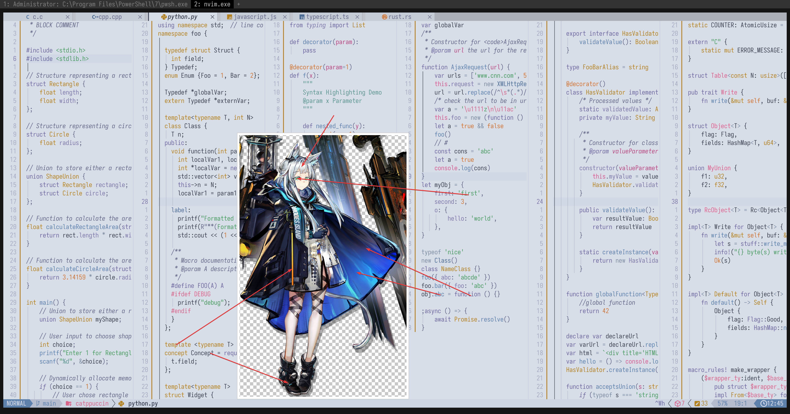

# rosmontis_(arknights)

- **Character:** 迷迭香
- **Source:** 明日方舟 / Arknights
- **Alias:** `纳西莎` (Real name), `Rosmontis`, `Narcissa` (EN), `ロスモンティス`, `ナルシッサ` (JP)
- **Reference:** [Donmai Wiki](<https://donmai.moe/wiki_pages/rosmontis_(arknights)>), [PRTS](https://prts.wiki/w/%E8%BF%B7%E8%BF%AD%E9%A6%99)
- **Index:** `#10`

---

> `rosmontis_(arknights)` is the 10th character in this project.

## Palette Files

| File                                                            | Purpose                                         |
| --------------------------------------------------------------- | ----------------------------------------------- |
| [`palette.json`](./palette.json)                                | Full color data                                 |
| [`palette-whiskers.json`](./palette-whiskers.json) | Catppuccin “color_overrides” ready for Whiskers |

### Contrast Matrix

| File                                                         | Description                  |
| ------------------------------------------------------------ | ---------------------------- |
| [`contrast-matrix.json`](./contrast/contrast-matrix.json) | All-vs-all contrast ratios   |
| [`contrast-base.json`](./contrast/contrast-base.json)     | Each swatch against **Base** |
| [`contrast-report.md`](./contrast/contrast-report.md)     | Human-readable summary       |

## Reference Artwork
 
A picture (or two) used for color sampling.
 


## Porting How-Tos
 
<details>
<summary>Neovim example (Catppuccin latte)</summary>

```lua
require("catppuccin").setup {
    color_overrides = {
        latte = {
        rosewater= "#CF6D4F",
        flamingo = "#D27051",
        pink     = "#B87F53",
        mauve    = "#6C699F",
        red      = "#DC634D",
        maroon   = "#B04F4A",
        peach    = "#D1732F",
        yellow   = "#B3821F",
        green    = "#469B60",
        teal     = "#5A9591",
        sky      = "#7D8DA2",
        sapphire = "#4C6C94",
        blue     = "#5E81AC",
        lavender = "#7C79A9",
        text     = "#3B4251",
        subtext0 = "#5A616F",
        subtext1 = "#4A5161",
        base     = "#D8DEE8",
        mantle   = "#CED5E3",
        crust    = "#C5CDDD",
        surface0 = "#B5BCCE",
        surface1 = "#A4ABC1",
        surface2 = "#939BB2",
        overlay0 = "#838AA4",
        overlay1 = "#727896",
        overlay2 = "#636986",
        },
    }
}
```

</details>
