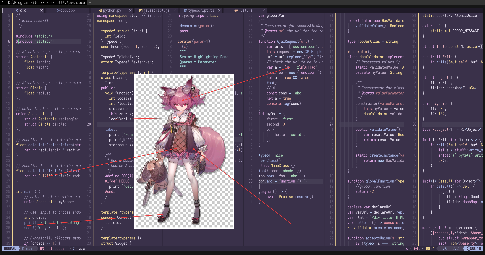

# shamare_(arknights)

- **Character:** 巫恋
- **Source:** 明日方舟 / Arknights
- **Alias:** `Shamare` (EN), `シャマレ` (JP)
- **Reference:** [Safebooru Wiki](<https://safebooru.donmai.us/wiki_pages/shamare_(arknights)>), [PRTS](https://prts.wiki/w/%E5%B7%AB%E6%81%8B)
- **Index:** `#7`

---

> `shamare_(arknights)` is the 7th character in this project.

## Palette Files

| File                                                            | Purpose                                         |
| --------------------------------------------------------------- | ----------------------------------------------- |
| [`palette.json`](./palette.json)                                | Full color data                                 |
| [`palette-whiskers.json`](./palette-whiskers.json) | Catppuccin “color_overrides” ready for Whiskers |

### Contrast Matrix

| File                                                         | Description                  |
| ------------------------------------------------------------ | ---------------------------- |
| [`contrast-matrix.json`](./contrast/contrast-matrix.json) | All-vs-all contrast ratios   |
| [`contrast-base.json`](./contrast/contrast-base.json)     | Each swatch against **Base** |
| [`contrast-report.md`](./contrast/contrast-report.md)     | Human-readable summary       |

## Reference Artwork
 
A picture (or two) used for color sampling.
 


## Porting How-Tos
 
<details>
<summary>Neovim example (Catppuccin frappe)</summary>

```lua
require("catppuccin").setup {
    color_overrides = {
        frappe = {
        rosewater= "#F2CED5",
        flamingo = "#EFB9C3",
        pink     = "#E8A2C0",
        mauve    = "#DDA6E3",
        red      = "#E591A2",
        maroon   = "#B97C88",
        peach    = "#E8B49A",
        yellow   = "#F0D591",
        green    = "#A9D8B8",
        teal     = "#9ACECF",
        sky      = "#B3CBF2",
        sapphire = "#8793C2",
        blue     = "#A6B3E3",
        lavender = "#B8A9C3",
        text     = "#E2DCEC",
        subtext0 = "#BCB3C9",
        subtext1 = "#CFC5DD",
        base     = "#3A314A",
        mantle   = "#322B41",
        crust    = "#2A2436",
        surface0 = "#4A435A",
        surface1 = "#5B536C",
        surface2 = "#6C647D",
        overlay0 = "#817896",
        overlay1 = "#9288A8",
        overlay2 = "#A89FBD",
        },
    }
}
```

</details>
