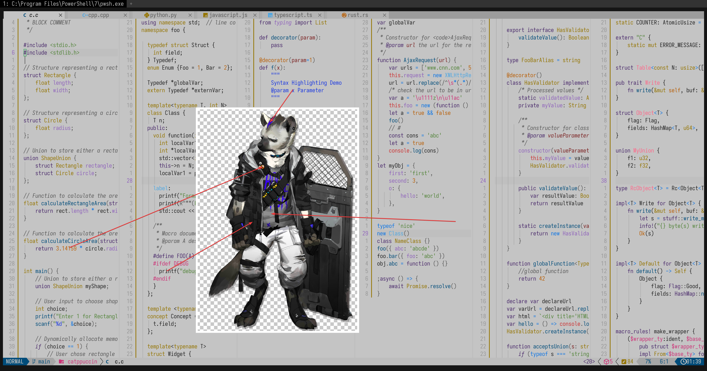

# spot_(arknights)

- **Character:** 斑点
- **Source:** 明日方舟 / Arknights
- **Alias:** `伯克依·博尔努` (Real Name), `Spot`, `Bukar Bornu` (EN), `スポット` (JP)
- **Reference:** [Safebooru Wiki](<https://safebooru.donmai.us/wiki_pages/spot_(arknights)>), [PRTS](https://prts.wiki/w/%E6%96%91%E7%82%B9)
- **Index:** `#8`

---

> `spot_(arknights)` is the 8th character in this project.

## Palette Files

| File                                                            | Purpose                                         |
| --------------------------------------------------------------- | ----------------------------------------------- |
| [`palette.json`](./palette.json)                                | Full color data                                 |
| [`palette-whiskers.json`](./palette-whiskers.json) | Catppuccin “color_overrides” ready for Whiskers |

### Contrast Matrix

| File                                                         | Description                  |
| ------------------------------------------------------------ | ---------------------------- |
| [`contrast-matrix.json`](./contrast/contrast-matrix.json) | All-vs-all contrast ratios   |
| [`contrast-base.json`](./contrast/contrast-base.json)     | Each swatch against **Base** |
| [`contrast-report.md`](./contrast/contrast-report.md)     | Human-readable summary       |

## Reference Artwork
 
A picture (or two) used for color sampling.
 


## Porting How-Tos
 
<details>
<summary>Neovim example (Catppuccin latte)</summary>

```lua
require("catppuccin").setup {
    color_overrides = {
        latte = {
        rosewater= "#DC2E85",
        flamingo = "#E72747",
        pink     = "#E12D69",
        mauve    = "#8C6AAF",
        red      = "#CC3333",
        maroon   = "#7A1F1F",
        peach    = "#B85E05",
        yellow   = "#947400",
        green    = "#528439",
        teal     = "#1937E1",
        sky      = "#0C74E4",
        sapphire = "#0A7EBD",
        blue     = "#007EC2",
        lavender = "#8F63BB",
        text     = "#222222",
        subtext0 = "#1A1A1A",
        subtext1 = "#121212",
        base     = "#C4C4C4",
        mantle   = "#BDBDBD",
        crust    = "#B5B5B5",
        surface0 = "#A6A6A6",
        surface1 = "#969696",
        surface2 = "#878787",
        overlay0 = "#787878",
        overlay1 = "#696969",
        overlay2 = "#595959",
        },
    }
}
```
</details>
