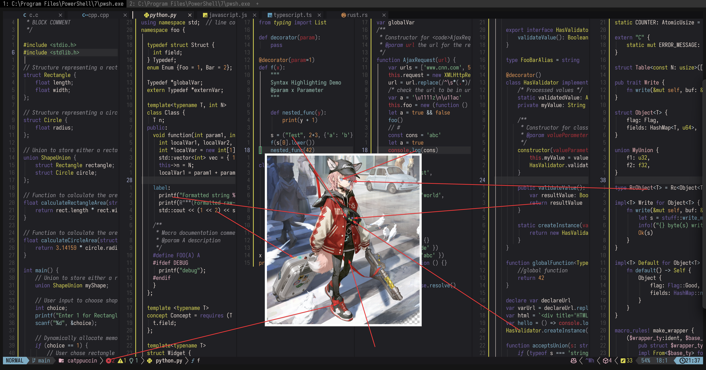

# sussurro_(travel_freely)_(arknights)

- **Character:** 苏苏洛（随意而行）
- **Source:** 明日方舟 / Arknights
- **Alias:** `Sussurro (Travel Freely)` (EN), `ススーロ (勝手気まま)` (JP)
- **Reference:** [Donmai Wiki](<https://donmai.moe/wiki_pages/sussurro_(travel_freely)_(arknights)>), [PRTS](https://prts.wiki/w/%E8%8B%8F%E8%8B%8F%E6%B4%9B)
- **Index:** `#11`

---

> `sussurro_(travel_freely)_(arknights)` is the 11th character in this project.

## Palette Files

| File                                               | Purpose                                         |
| -------------------------------------------------- | ----------------------------------------------- |
| [`palette.json`](./palette.json)                   | Full color data                                 |
| [`palette-whiskers.json`](./palette-whiskers.json) | Catppuccin “color_overrides” ready for Whiskers |

### Contrast Matrix

| File                                                         | Description                  |
| ------------------------------------------------------------ | ---------------------------- |
| [`contrast-matrix.json`](./contrast/contrast-matrix.json) | All-vs-all contrast ratios   |
| [`contrast-base.json`](./contrast/contrast-base.json)     | Each swatch against **Base** |
| [`contrast-report.md`](./contrast/contrast-report.md)     | Human-readable summary       |

## Reference Artwork

A picture (or two) used for color sampling.



## Porting How-Tos

<details>
<summary>Neovim example (Catppuccin macchiato)</summary>

```lua
require("catppuccin").setup {
    color_overrides = {
        macchiato = {
        rosewater= "#f0dadb",
        flamingo = "#edb4b8",
        pink     = "#e5b4c4",
        mauve    = "#7462aa",
        red      = "#c94049",
        maroon   = "#ad3139",
        peach    = "#de9657",
        yellow   = "#dbd756",
        green    = "#84bc8c",
        teal     = "#9dc6b9",
        sky      = "#cadde7",
        sapphire = "#649fbf",
        blue     = "#7fadc5",
        lavender = "#a9b0d4",
        text     = "#ece0d8",
        subtext1 = "#d1cecb",
        subtext0 = "#bababa",
        base     = "#202024",
        mantle   = "#19181b",
        crust    = "#121113",
        surface0 = "#353537",
        surface1 = "#4a4a4a",
        surface2 = "#5c5c5c",
        overlay0 = "#717171",
        overlay1 = "#858585",
        overlay2 = "#98969c",
        },
    }
}
```

</details>
