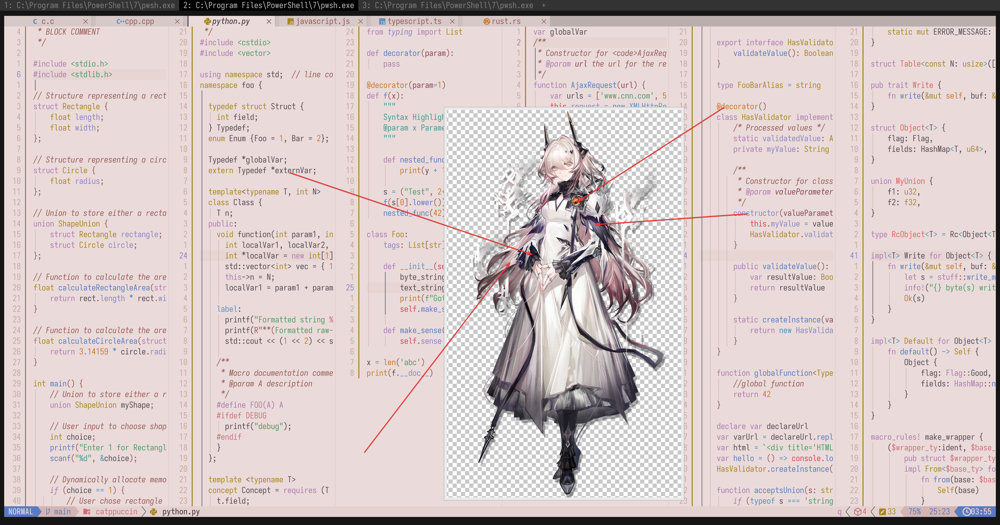

# theresa_(arknights)

- **Character:** 特蕾西娅
- **Source:** 明日方舟 / Arknights
- **Alias:** `魔王` (CN), `Theresa` (EN), `テレジア` (JP)
- **Reference:** [Donmai Wiki](<https://donmai.moe/wiki_pages/theresa_(arknights)>), [Moegirlpedia](<https://zh.moegirl.org.cn/zh-hans/%E7%89%B9%E8%95%BE%E8%A5%BF%E5%A8%85(%E6%98%8E%E6%97%A5%E6%96%B9%E8%88%9F)>)
- **Index:** `#6`

---

> `theresa_(arknights)` is the 6th character in this project.
>
> The first version looked very similar to [Rosé Pine](https://rosepinetheme.com/), so I removed the yellow and added some red to give it a more unique look.
> The second version wasn't pink enough. To achieve the right shade of pink, I actually needed a darker color, which I adjusted as much as possible while maintaining an acceptable contrast ratio.
>
> Since this character is thematically related to the [previous one](../arknights_priestess/README.md), I decided to work on them back-to-back. You could say I made this one "while I was at it."
>
> Interestingly, the contrast between Base and Subtext0 did not reach 4.5:1. After reviewing the character art again, I decided not to fix it.

## Palette Files

| File                                                            | Purpose                                         |
| --------------------------------------------------------------- | ----------------------------------------------- |
| [`palette.json`](./palette.json)                                | Full color data                                 |
| [`palette-whiskers.json`](./palette-whiskers.json) | Catppuccin “color_overrides” ready for Whiskers |

### Contrast Matrix

| File                                                         | Description                  |
| ------------------------------------------------------------ | ---------------------------- |
| [`contrast-matrix.json`](./contrast/contrast-matrix.json) | All-vs-all contrast ratios   |
| [`contrast-base.json`](./contrast/contrast-base.json)     | Each swatch against **Base** |
| [`contrast-report.md`](./contrast/contrast-report.md)     | Human-readable summary       |

## Reference Artwork
 
A picture (or two) used for color sampling.
 


## Porting How-Tos
 
<details>
<summary>Neovim example (Catppuccin latte)</summary>

```lua
require("catppuccin").setup {
    color_overrides = {
        latte = {
        rosewater= "#cf6d7d",
        flamingo = "#dd6363",
        pink     = "#b74757",
        mauve    = "#af78af",
        red      = "#d7425b",
        maroon   = "#8a4254",
        peach    = "#ca7623",
        yellow   = "#a7851d",
        green    = "#4b9b66",
        teal     = "#419891",
        sky      = "#4692b8",
        sapphire = "#5d8fc1",
        blue     = "#597bc0",
        lavender = "#8d82c3",
        text     = "#534853",
        subtext0 = "#746474",
        subtext1 = "#635663",
        base     = "#EADBDA",
        mantle   = "#E4D2D0",
        crust    = "#DFC8C6",
        surface0 = "#D4B5B3",
        surface1 = "#C9A29F",
        surface2 = "#BE8F8C",
        overlay0 = "#B37C78",
        overlay1 = "#A86965",
        overlay2 = "#985A56",
        },
    }
}
```

</details>
